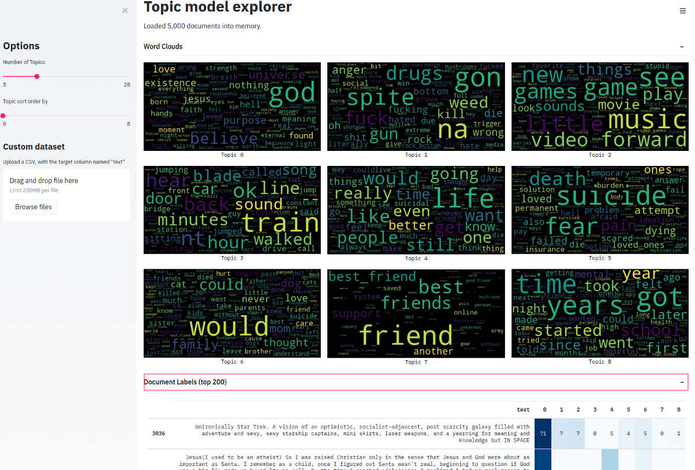

# MALLET Dockerized

+ Dockerized wrapper for LDA software [MALLET](http://mallet.cs.umass.edu/index.php).
+ Preprocesses text using spaCy and uses NLTKs stopword list.
+ API provided fastAPI, containerized by Docker, and example interface served by Streamlit.

**Work-in-progress, and unstable. Development mode only.**

Produced for use within CDC/NCHS, [released to the public domain](LICENSE).

Tested on AWS with AMI: Deep Learning AMI (Ubuntu 18.04) Version 38.0 - ami-02e86b825fe559330, t2.large ($0.0928/hour), custom open ports 8000-9000. Install notes:

    sudo apt install docker-compose
    sudo systemctl unmask docker
    sudo systemctl start docker
    docker-compose up -d
    pip install streamlit wordcloud
    nohup streamlit run streamlit_app.py